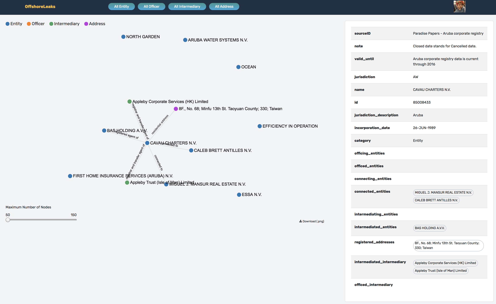
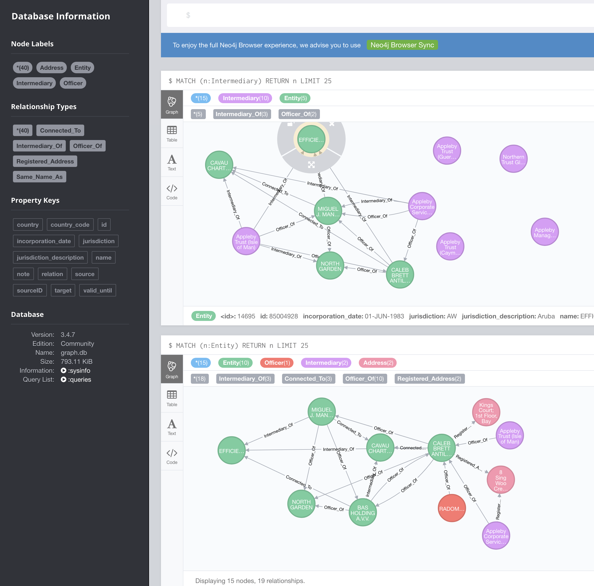

# README

This is a sample project named OffshoreLeaks, build with Neo4j, Express.js, react

### Tech
* DB: Neo4j -- Use graphical database to support the "relational" data
* Backend: 
  * Node (Express API) --For fast and lighweight backend implementation
  * swagger --For API documentation
* Frontend: 
  * webpack --better mudule bundling tool for frontend
  * react -- fast and lightweight front end implementation, better scalability, fast development 
  * redux, redux-saga -- state management tool, this makes the application easily scalable
  * react-sigma-graph -- graph library
* Dependency manager: yarn
* Node version: (managed by n)

### Deployment
* The Project was originally being deployed on aws ec2, but there was some critical issue on the NEO4J shell, which prevented data being imported into the db server hosted on ec2.
* Thus I have to use a tunneling service to connect my localhost to the inernet.
### Demo:
* frontend interface: http://localhost:8080/app, You can access the tunneled address: http://offshoreleak.ap.ngrok.io

* backend api developed in Express web framework for Node.js. The api endpoints at: http://localhost:3000/api/v0/
* The API endpoints are documented using swagger, available at: http://localhost:3000/docs
* neo4j server Remote interface available at http://localhost:7474/ 

### What's done
* Analyse data relationship
* Create Neo4J database server to store the nodes and edges data
* Import data into Neo4J from scv
* Build backend api to query the list of nodes and a detail information of a single node (together with relationships), for all node types
* Document api scheme in swagger
* Build frontend to visulize data relationship
    1. Filter by Node type, eg: All Entity --display all the entity nodes only
    2. Click each node to explore its graphical relationship with other nodes -- relationship will be drawn after a node is clicked, provided the node has associated relations
    3. Node's detailed information and all relationship information will be available in a tabular format as well.

### What can be improved
Due to time limitation, below improment could not be achived but will be good for future imprivement
1. Make use of the complete data set so that the relationship can reflect the real case senarior
2. `Ngrok` tunneling was used to tunnel external network to my localhost, idealy cloud deployment should be done

### DB
1. Install Neo4J community version
2. add the NEO4J folder path to $NEO4J_HOME
3. run add_constraints.sh
4. run start_db.sh
5. in NEO4J brower client, run the statements inside dataLoad.cql

### Backend
1. The Backend code is located in the `/server` folder.
2. `yarn install`  or `npm install`
3. `yarn start` or `npm start`

### Frontend
1. The Frontend code is located in the `/client` folder.
2. `yarn install`  or `npm install`
3. `yarn start` or `npm start`

### Nodes 

* `Entity`
* `Officer`
* `Address`
* `Intermediary`

### Relationships 
Assumming below relationships:
### Entity:
* `(e:Entity) -[Officer_Of]->(e:Entity)`    --Officing Entity
* `(e:Entity) <-[Officer_Of]-(e1:Entity)`    --Officed Entity
* `(e:Entity) -[Connected_To]->(e1:Entity)`    --Connecting Entity
* `(e:Entity) <-[Connected_To]-(e1:Entity)`    --Connected Entity
* `(e:Entity) -[Intermediary_Of]->(e1:Entity)`    --Intermediating Entity
* `(e:Entity) <-[Intermediary_Of]-(e1:Entity)`    --Intermediated Entity
* `(e:Entity) <-[Officer_Of]-(i:Intermediary)`    --Officed Intermediary
* `(e:Entity) <-[Intermediary_Of]-(i:Intermediary)`    --Intermediated Intermediary
* `(e:Entity) -[Registered_Address]->(e1:Entity)`    --Registered Addresses

### Officer:
* `(o:Officer) -[Officer_Of] -> (e:Entity)`        -- Officing Entitites
* `(o:Officer) -[Same_Name_As] -> (o:Officer)`       -- Same Name Officers
* `(o:Officer) -[Registered_Address] -> (a:Address)`     --Registered Addresses

### Address:
* `(a:Address) <-[Registered_Address]-(e:Entity)`     --Registered Entities
* `(a:Address) <-[Registered_Address]-(o:Officer)`         --Registered Officers
* `(a:Address) <-[Registered_Address]-(i:Intermediary)`         --Registered Intermediaries

### Intermediary:
* `(i:Intermediary)-[Intermediary_Of]->(e:Entity)`    --Intermediating Entities
* `(i:Intermediary)-[Officer_Of]->(e:Entity)`    --Officing Entities
* `(i:Intermediary)-[Registered_Address]->(a:Address)`    --Registered Addresses

## Important Notes on Nodes/Relations: 
* Removed empty/incomplete data columns from original data sets.
* Due to huge data set,  only top 10 rows for each node type were loaded.
* Since the top 10 records in one type dont necesssarily relate to top 10 records in another type, relationship have been mocked for illustration purpose, they may not have practical reference

### Scalability
The project structure was well setup to support future scalability.
One can easily extend the project and add features to make it a full-fledged application